<div align="center">

<a href="https://guz-studio.dev">
  
</a>

<p>
  <a href="https://guz-studio.dev"></a>
  <a href="mailto:ceo@guz-studio.dev"></a>
  
</p>

</div>

```bash
$ whoami
RomanshkVolkov — ingeniero de software, fundador de G-Studio

$ cat focus.txt
backend de alta demanda · plataforma e infraestructura · seguridad y edge
frontend cuando el proyecto lo pide

$ uptime
4+ años en producción · desde 2022
```

## 🛠️ Stack

<p align="center">
  <br/>
  
</p>

| | |
|---|---|
| **Backend** | Go (APIs REST, gRPC, WebSockets, servicios concurrentes) · Rust · Node.js / Next.js · Svelte / SvelteKit |
| **Plataforma** | Docker Swarm + Traefik · Kubernetes · GitHub Actions · Azure Blob Storage · VPS Linux y redes |
| **Seguridad** | Hardening de servidores y contenedores · WAF / reverse proxies · secretos con 1Password y GitHub Actions Secrets |

## 🚀 Lo que hago

- **Infraestructura multi-cliente** con Docker Swarm y Kubernetes, con despliegues automatizados vía CI/CD.
- **Stacks aislados por cliente** y pipelines de automatización con LLMs.
- **Respuesta a incidentes:** contención de ataques activos en producción y recuperación de archivos desde S3.
- **Superficie de ataque mínima:** secretos fuera del repo y de las máquinas, inyectados solo en CI.

> ¿Necesitas backend o infraestructura sin contratar un equipo in-house? → **[guz-studio.dev](https://guz-studio.dev)**

## 📊 Stats

<p align="center">
  
  
</p>

<p align="center">
  
</p>
